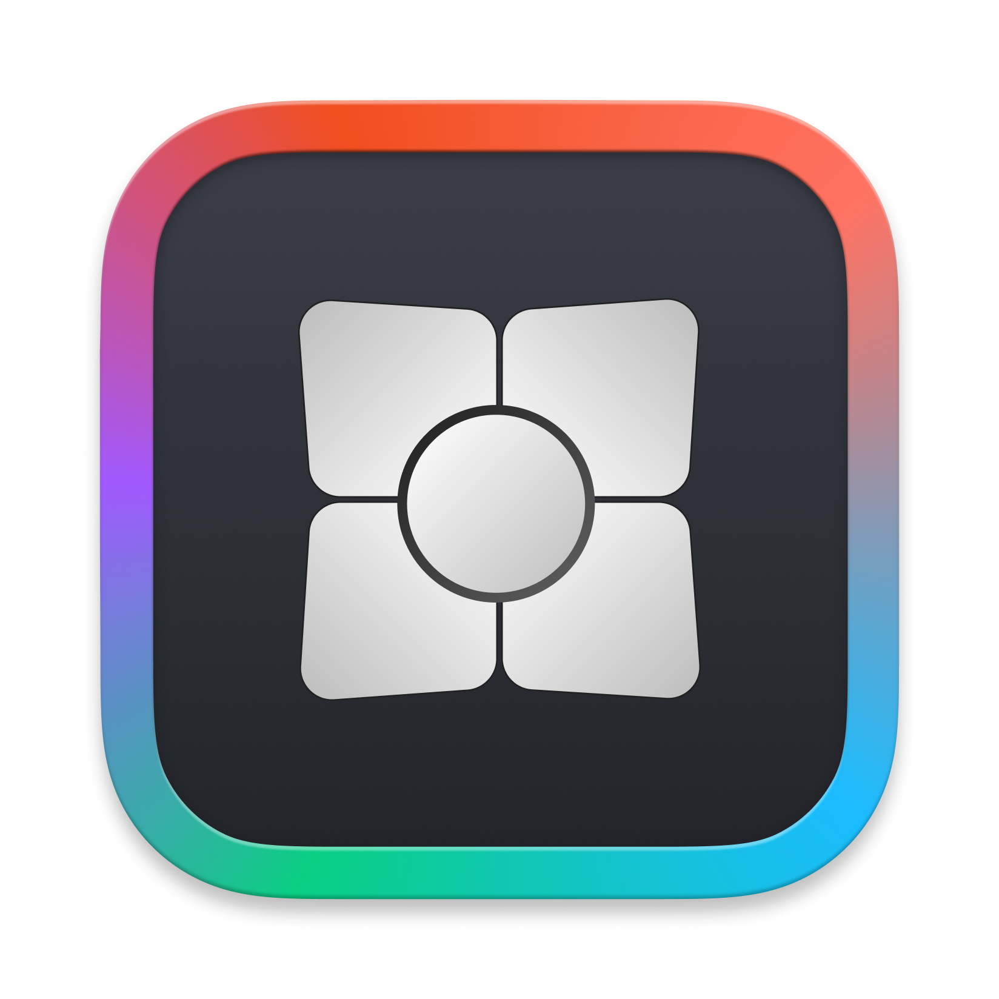

<div align="center">
  
  <h1>Widgets Link</h1>
  <p>Share your MacBook screen to Widgets mixed reality app on Meta Quest headsets</p>
</div>

<div align="center">
  
  [](https://discord.com/invite/nSYrHPT5uP)

</div>


**Widgets Link** is a specialized macOS application that enables seamless screen sharing from your MacBook to the **Widgets mixed reality application** on Meta Quest headsets. Transform your MacBook into a powerful mixed reality workspace by streaming your screen directly to your VR headset.

<div align="center">
  
  <p><em>Widgets Link in action - streaming MacBook screen to Widgets</em></p>
</div>

## Features

- **Meta Quest Integration**: Seamlessly connect to Widgets mixed reality app
- **Real-time Screen Sharing**: Stream your MacBook display to VR in real-time
- **Optimized Performance**: Built specifically for Apple Silicon (M-series) MacBooks
- **Privacy Focused**: Local processing with no cloud data transmission
- **Secure Pairing**: Pair via a one-time security code shown in the PC Connect widget, then click Start Capture

## System Requirements

- **MacBook**: Must have Apple Silicon based Mac's
- **macOS**: 12.0 (Monterey) or later
- **Meta Quest**: Quest 2, Quest Pro, or Quest 3 with Widgets app installed
- **Network**: Both devices must be on the same Wi-Fi network
- **Storage**: 100MB available space

## Download

📥 **Download the latest version**: [Latest Release](https://github.com/Priyanshu-CODERX/Widgets-Link-Stream/releases/)

**File Format**: `.zip` archive containing the Widgets Link application

## Installation

### Step 1: Download
1. Click the download link above
2. Download the `.zip` file for your M-series MacBook

### Step 2: Extract and Install
1. **Extract the downloaded `.zip` file** (double-click in Downloads folder)
2. **Move `Widgets Link.app` to your Applications folder**
3. **Open Terminal** (Applications → Utilities → Terminal, or use Spotlight: ⌘+Space, then type "Terminal")

### Step 3: Remove Quarantine Attributes
Since this is an unsigned app, macOS will block it from running. You need to remove the quarantine attributes:

<div align="center">

  
  
</div>

*This is what you'll see when trying to run the unsigned app - macOS blocks it as "damaged"*

**Option 1: If the app is in Applications folder:**
```bash
xattr -dr com.apple.quarantine "Widgets Link.app"
```

**Option 2: If the app is still in Downloads or another location:**
```bash
xattr -dr com.apple.quarantine path/to/"Widgets Link.app"
```

**Note**: Replace `path/to/` with the actual path where you extracted the app.

### Step 4: Launch the App
1. **Navigate to Applications folder** and double-click `Widgets Link.app`
2. The app should now launch without security warnings

**Important**: You only need to run the quarantine removal command once per app installation and this won't effect you mac.

## Required Permissions

### Screen Recording Permission
Widgets Link automatically requests Screen Recording permission on first launch:

1. **Launch Widgets Link** (following the steps above)
2. When the permission dialog appears, click **"Open System Settings"**
3. In System Settings, navigate to **Privacy & Security** → **Screen Recording**
4. **Toggle ON** the switch next to **Widgets Link**
5. **Quit the app completely** (⌘+Q)
6. **Reopen Widgets Link** - it should now work properly

### Manual Permission Setup (if needed)
If the app doesn't prompt for permissions automatically:

1. Open **System Settings** (or System Preferences on older macOS)
2. Go to **Privacy & Security** → **Screen Recording**
3. Find **Widgets Link** in the list and toggle it **ON**
4. **Quit and reopen** the app

## Usage

### Getting Started
1. On your Meta Quest headset, open the **Widgets** app, then open the **PC Connect** widget. A one-time **security code** will be displayed.
2. On your MacBook, launch **Widgets Link** from Applications or Spotlight (⌘+Space, then type "Widgets Link").
3. Enter the **security code** shown in the PC Connect widget into Widgets Link on your MacBook.
4. Click **Start Capture**.
5. If prompted, grant **Screen Recording** permission.
6. Your MacBook screen will now stream to the **PC Connect** widget in the Widgets mixed reality app.

### Connection Process
- Both devices must be on the **same Wi‑Fi network**
- Open the **PC Connect** widget on the headset to get the security code
- Enter the code in **Widgets Link** on your MacBook
- Click **Start Capture** to begin streaming
- Your MacBook display appears inside the **Widgets** mixed reality environment

### Disconnecting
- Click **Disconnect** in Widgets Link
- Or close Widgets Link to end the session

## Troubleshooting

### App Won't Open
- **Follow the First Launch steps** above (right-click → Open)
- Check if the app is blocked in **System Settings** → **Privacy & Security** → **Security**
- Try **restarting your MacBook** and launching again

### Permissions Not Working
- **Quit the app completely** (⌘+Q)
- **Recheck permissions** in System Settings
- **Restart your MacBook** and try again

### Can't Connect to Quest
- Ensure both devices are on the **same Wi‑Fi network**
- Confirm the **Widgets app** is running and the **PC Connect** widget is open
- Verify you entered the **exact security code** shown in the headset
- Try **restarting both devices** and reconnecting
- Ensure the **Quest headset is awake** (not in sleep mode)

### Security Code Issues
- If the code shows as **invalid**, double‑check each digit and try again
- If the code **expired**, reopen the **PC Connect** widget to get a new code
- Make sure there are **no leading/trailing spaces** when entering the code

### Screen Not Sharing
- Ensure **Screen Recording permission** is granted to Widgets Link
- Confirm you clicked **Start Capture** after entering the code
- Keep the **PC Connect** widget open on the headset while streaming
- Try **Disconnect**, then reconnect with a fresh code

### Performance Issues
- **Close unnecessary applications** on your MacBook
- Ensure a **stable Wi‑Fi connection** between devices
- **Restart both devices** if you experience lag or stuttering

## Screenshots

### Main Application Interface

*The main Widgets Link application interface for connecting to Meta Quest headsets*

### Permission Setup Process

*Permission dialog with two options: "Open System Settings" or "Deny" - click "Open System Settings"*


*Toggle ON the Screen Recording permission for Widgets Link in System Settings*

---

*These screenshots show the complete permission setup process from initial request to enabling the toggle*

## Support

- **Issues**: Report bugs or problems on the [GitHub Issues page](https://github.com/Priyanshu-CODERX/Widgets-Link-Stream/issues)
- **Questions**: Check existing issues or create a new one for help
- **Feature Requests**: We welcome suggestions for improving the Meta Quest integration

## Community

Join our **Discord server** to connect with other Widgets Link users, get real-time support, share your experiences, and stay updated on the latest features!

<div align="center">
  
  [](https://discord.com/invite/nSYrHPT5uP)

</div>

**Why join our Discord?**
- 🚀 **Get help instantly** from the community and developers
- 💡 **Share tips and tricks** for the best mixed reality experience
- 🔔 **Stay updated** on new releases and features
- 🎮 **Connect with other VR enthusiasts** using Widgets
- 🐛 **Report issues** and get quick feedback

## License

This project is licensed under the MIT License - see the [LICENSE.txt](LICENSE.txt) file for details.

---

**Widgets Link** - Bridge your MacBook to the mixed reality world of Widgets on Meta Quest.

*Built specifically for Apple Silicon MacBooks to deliver the best mixed reality experience* 